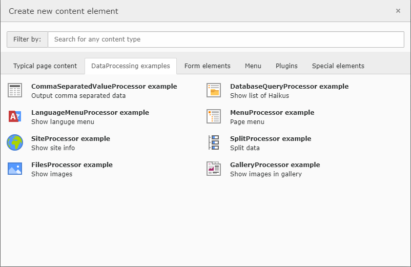

.. include:: /Includes.txt

.. _cobj-fluidtemplate-properties-dataprocessing:
.. _dataProcessing:

==============
dataProcessing
==============

:typoscript:`dataProcessing` is a property of :ref:`cobj-fluidtemplate`.

.. rst-class:: dl-parameters

dataProcessing
   :sep:`|` :aspect:`Data type:` array of class references by full namespace
   :sep:`|`

   Add one or multiple processors to manipulate the :php:`$data` variable of
   the currently rendered content object, like tt_content or page. The sub-
   property :ts:`options` can be used to pass parameters to the processor
   class.

There are several data processors available to allow flexible processing,
for example for comma-separated values, related files or related records.

.. toctree::
   :titlesonly:

   DataProcessing/CommaSeparatedValueProcessor
   DataProcessing/DatabaseQueryProcessor
   DataProcessing/FilesProcessor
   DataProcessing/GalleryProcessor
   DataProcessing/LanguageMenuProcessor
   DataProcessing/MenuProcessor
   DataProcessing/SiteProcessor
   DataProcessing/SplitProcessor
   DataProcessing/CustomDataProcessors

.. _dataProcessing-about-examples:

About the examples
==================

All examples listed here can be found in the TYPO3 Documentation Team
extension `examples <https://extensions.typo3.org/extension/examples/>`__.

Once the extension t3docs/examples is installed the examples are available
as content elements:

All examples listing here depend on
:ref:`t3coreapi:adding-your-own-content-elements`.  Data processors can
also be used in rendering page templates. In this case TypoScript context
would be the page record and all fields of the :typoscript:`pages` table
are available.

All examples base on :typoscript:`lib.contentElement`, which is provided by
the system extension :ref:`fluid_styled_content <fsc:start>`.

In this system extension it is defined as follows::

   lib.contentElement >
   lib.contentElement = FLUIDTEMPLATE
   lib.contentElement {
      templateName = Default
      // ...
   }

The extension `examples` also sets the paths to the additional templates::

   lib.contentElement {
      templateRootPaths.200 = EXT:examples/Resources/Private/Templates/ContentElements/
      partialRootPaths.200 = EXT:examples/Resources/Private/Partials/ContentElements/
      layoutRootPaths.200 = EXT:examples/Resources/Private/Layout/
   }
