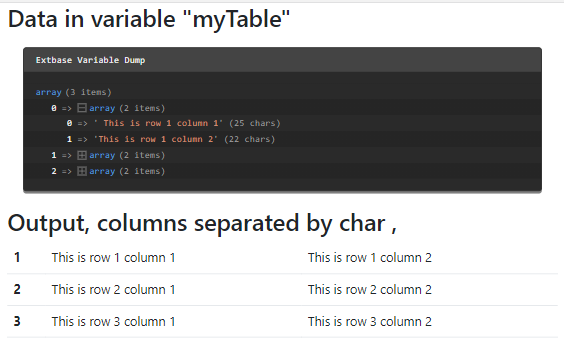

.. include:: /Includes.txt
.. _CommaSeparatedValueProcessor:

============================
CommaSeparatedValueProcessor
============================

The :php:`CommaSeparatedValueProcessor` allows to split values into a two-
dimensional array used for CSV files or tt_content records of CType
"table".

The table data is transformed to a multi dimensional array, taking the delimiter and enclosure into account,
before it is passed to the view.

Options:
========

.. confval:: if

   :Required: false
   :type: :ref:`if` condition
   :default: ""

   If the condition is not met the data is not processed

.. confval:: fieldName

   :Required:  true
   :type: string, :ref:`stdWrap`
   :default: ''

   Name of the field in the processed ContentObjectRenderer

.. confval:: as

   :Required:  false
   :type: string
   :default: defaults to the fieldName

   The variable's name to be used in the Fluid template

.. confval:: maximumColumns

   :Required:  false
   :type: int, :ref:`stdWrap`
   :default: 0

   Maximal number of columns to be transformed. Excess columns will be
   silently dropped. When set to 0 (default) all columns will be
   transformed.

.. confval:: fieldDelimiter

   :Required:  false
   :type: string(1), :ref:`stdWrap`
   :default: ','

   The field delimiter, a character separating the values.

.. confval:: fieldEnclosure

   :Required:  false
   :type: string(1), :ref:`stdWrap`
   :default: '"'

   The field enclosure, a character surrounding the values.

.. note:: It is currently not possible to unset the fieldEnclosure.
   See: `Issue 93190 <https://forge.typo3.org/issues/93190>`__

Example: Transforming comma separated content into a html table
===============================================================

Please see also :ref:`dataProcessing-about-examples`.

In this example the field :php:`bodytext` contains comma separated
values (CSV) data. To support different formats the separator between
the values can be chosen.

This example is also described in-depth in :ref:`TYPO3 Explained:
Extended content element example <t3coreapi:AddingCE-Extended-Example>`.

Example data in the field :php:`bodytext`
-----------------------------------------

Field :php:`bodytext` in table :php:`tt_content`::

   This is row 1 column 1,This is row 1 column 2,This is row 1 column 3
   This is row 2 column 1,This is row 2 column 2,This is row 2 column 3
   This is row 3 column 1,This is row 3 column 2,This is row 3 column 3

TypoScript
----------

We define the dataProcessing property to use the CommaSeparatedValueProcessor::

   tt_content {
     # lib.contentElement = FLUIDTEMPLATE
      examples_newcontentcsv =< lib.contentElement
      examples_newcontentcsv {
         templateName = DataProcCsv
         dataProcessing.10 = TYPO3\CMS\Frontend\DataProcessing\CommaSeparatedValueProcessor
         dataProcessing.10 {
            if.isTrue.field = bodytext
            fieldName = bodytext
            fieldDelimiter.field = tx_examples_separator
            fieldEnclosure = "
            maximumColumns.field = imagecols
            as = myTable
         }
      }
   }

The Fluid template
------------------

In the Fluid template you can iterate over the processed data. "myContentTable" can
be used as a variable :html:`{myContentTable}` inside Fluid for iteration.

.. code-block:: html

   <html data-namespace-typo3-fluid="true"
         xmlns:f="http://typo3.org/ns/TYPO3/CMS/Fluid/ViewHelpers">
      <h2>Data in variable "myTable"</h2>
      <f:debug inline="true">{myTable}</f:debug>

      <h2>Output, {data.imagecols} columns separated by char {data.tx_examples_separator}</h2>
      <table class="table table-hover">
         <f:for each="{myTable}" as="columns" iteration="i">
            <tr>
               <th scope="row">{i.cycle}</th>
               <f:for as="column" each="{columns}">
                  <td>{column}</td>
               </f:for>
            <tr>
         </f:for>
      </table>
   </html>

Output
------

Using :typoscript:`maximumColumns` limits the amount of columns in the multi dimensional array.
In this example, the field data of the last column will be stripped off. Therefore the output would be:

