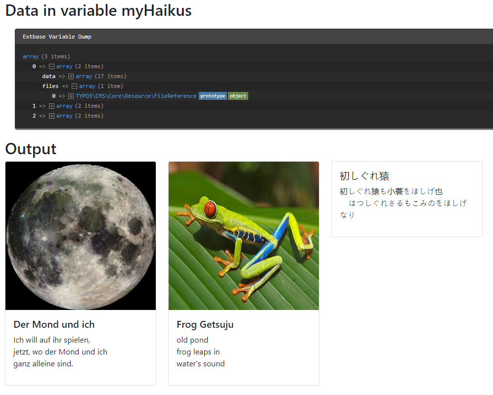

.. include:: /Includes.rst.txt
.. _DatabaseQueryProcessor:

======================
DatabaseQueryProcessor
======================

The :php:`DatabaseQueryProcessor` fetches records from the database,
using the default :ref:`select` semantics  from TypoScript. The result
then gets handed over to the :ref:`cobj-fluidtemplate` as an array.

This way a :ref:`cobj-fluidtemplate` cObject can iterate over the
array of records.

Options:
========

.. confval:: if

   :Required: false
   :type: :ref:`if` condition
   :default: ''

   If the condition is not met the data is not processed

.. confval:: table

   :Required: true
   :type: string, :ref:`stdWrap`
   :default: ''

   Name of the table from which the records should be fetched

.. confval:: as

   :Required: false
   :type: string, :ref:`stdWrap`
   :default: 'records'

   The variable's name to be used in the Fluid template

.. confval:: dataProcessing

   :Required: false
   :type: array of :ref:`dataProcessing`
   :default: ''

   Array of DataProcessors to be applied to all fetched records.

.. note:: all other options will be interpreted as in the TypoScript function
   "select", including :typoscript:`pidInList`, :typoscript:`orderBy`,
   :typoscript:`where` etc. See the reference of :ref:`select`.

Example: Display haiku records
==============================

Please see also :ref:`dataProcessing-about-examples`.

TypoScript
----------

We define the dataProcessing property to use the DatabaseQueryProcessor::

   tt_content {
      examples_dataprocdb =< lib.contentElement
      examples_dataprocdb {
         templateName = DataProcDb
         dataProcessing.10 = TYPO3\CMS\Frontend\DataProcessing\DatabaseQueryProcessor
         dataProcessing.10 {
            if.isTrue.field = pages
            table = tx_examples_haiku
            orderBy = title
            pidInList.field = pages
            as = myHaikus
            // recursively process the images in the records with the FilesProcessor
            dataProcessing {
               10 = TYPO3\CMS\Frontend\DataProcessing\FilesProcessor
               10 {
                  references.fieldName = image
               }
            }
         }
      }
   }

The Fluid template
------------------

In the Fluid template then iterate over the records. As we used the recursive data
processor :ref:`FilesProcessor` on the image records we also can output the images.

.. code-block:: html

   <html data-namespace-typo3-fluid="true" xmlns:f="http://typo3.org/ns/TYPO3/CMS/Fluid/ViewHelpers">
      <h2>Data in variable myHaikus</h2>
      <f:debug inline="true">{myHaikus}</f:debug>
      <h2>Output</h2>
      

         <f:for each="{myHaikus}" as="haiku">
            

               

                  <f:if condition="{haiku.files.0}">
                     <f:image image="{haiku.files.0}" class="card-img-top" height="300"/>
                  </f:if>
                  

                     <h5 class="card-title">{haiku.data.title}</h5>
                     
<f:format.html>{haiku.data.poem}</f:format.html>

                  

               

            

         </f:for>
      

   </html>

Output
------

The array of records each contains the data of the table in :php:`data` and
the data of the images in :php:`files`.

