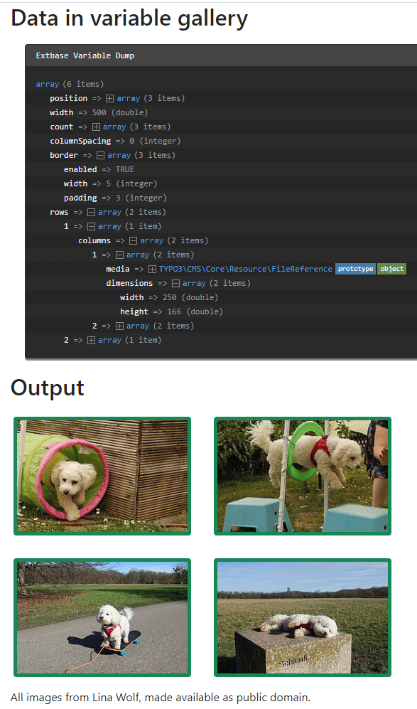

.. include:: /Includes.txt
.. _GalleryProcessor:

================
GalleryProcessor
================

The :php:`GalleryProcessor` provides the logic for working with galleries and
calculates the maximum asset size. It uses the files already present in
the `processedData` array for its calculations. The :php:`FilesProcessor` can be
used to fetch the files.

Options:
========

.. confval:: if

   :Required: false
   :type: :ref:`if` condition
   :default: ''

   If the condition is not met the data is not processed

.. confval:: filesProcessedDataKey

   :Required: true
   :type: string, :ref:`stdWrap`
   :default: 'files'
   :Example: 'myImages'

   Key of the array previously processed by the
   FilesProcessor

.. confval:: numberOfColumns

   :Required: false
   :type: int, :ref:`stdWrap`
   :default: field:imagecols
   :Example: 4

   Expects the desired number of columns. Defaults to the value of the field
   `imagecols` / "Number of Columns" if used with content elements.

.. confval:: mediaOrientation

   :Required: false
   :type: int, :ref:`stdWrap`
   :default: field:imageorient
   :Example: 2

   Expects the image orientation as used in the field imageorient
   in content elements such as text with images. Defaults to the value of the field
   `imageorient` / "Position and Alignment" if used with content elements.

   .. image:: Images/ImageOrientation.png
      :alt: Media orientation in the content elements such as text with images
      :class: with-shadow

.. confval:: maxGalleryWidth

   :Required: false
   :type: int, :ref:`stdWrap`
   :default: 600

   Maximal gallery width in pixels

.. confval:: maxGalleryWidthInText

   :Required: false
   :type: int, :ref:`stdWrap`
   :default: 300

   Maximal gallery width in pixels if displayed in a text

.. confval:: equalMediaHeight, equalMediaWidth

   :Required: false
   :type: int, :ref:`stdWrap`
   :default: field:imageheight, field:imagewidth
   :Example: 300

   If set all images get scaled to a uniform height / width. Defaults
   to the value of the fields `imageheight` / "Height of each element (px)",
   `imagewidth` / "Width of each element (px)"
   if used with content elements.

   .. image:: Images/MediaHeight.png
      :alt: Media height and width in the content element Text and Images
      :class: with-shadow

.. confval:: columnSpacing

   :Required: false
   :type: int, :ref:`stdWrap`
   :default: 0
   :Example: 4

   Space between columns in pixels

.. confval:: borderEnabled

   :Required: false
   :type: int, :ref:`stdWrap`
   :default: field:imageborder
   :Example: 1

   Should there be a border around the images? Defaults
   to the value of the fields `imageborder` / "Number of Columns"
   if used with content elements.

.. confval:: borderWidth

   :Required: false
   :type: int, :ref:`stdWrap`
   :default: 0
   :Example: 2

   Width of the border in pixels

.. confval:: borderPadding

   :Required: false
   :type: int, :ref:`stdWrap`
   :default: 0
   :Example: 20

   padding around the border in pixels

.. confval:: cropVariant

   :Required: false
   :type: int, :ref:`stdWrap`
   :default: "default" :aspect:`Example:`

   See :ref:`cropt variant in the TCA reference<t3tca:columns-imageManipulation-properties-cropVariants>`

.. confval:: as

   :Required: false
   :type: string, :ref:`stdWrap`
   :default: "files"

   The variable's name to be used in the Fluid template

.. confval:: dataProcessing

   :Required: false
   :type: array of :ref:`dataProcessing`
   :default: ""

   Array of DataProcessors to be applied to all fetched records.

Example: display images in rows and columns
===========================================

Please see also :ref:`dataProcessing-about-examples`.

TypoScript
----------

As the :php:`GalleryProcessor` expects the data of the files to be
present in the the `processedData` array, the :php:`FilesProcessor`
always has to be called first. Execution depends on the key in the
dataProcessing array, not the order in which they are put there.

The content of :typoscript:`filesProcessedDataKey` in the GalleryProcessor
has to be equal to the content of :typoscript:`as` in the FilesProcessor::

   tt_content {
      examples_dataprocgallery =< lib.contentElement
      examples_dataprocgallery {
         templateName = DataProcGallery
         dataProcessing {
            # Process files
            10 = TYPO3\CMS\Frontend\DataProcessing\FilesProcessor
            10 {
               as = images
               references.fieldName = image
               references.table = tt_content
               sorting = title
               sorting.direction = descending
            }

            # Calculate gallery info
            20 = TYPO3\CMS\Frontend\DataProcessing\GalleryProcessor
            20 {
               filesProcessedDataKey = images
               mediaOrientation.field = imageorient
               numberOfColumns.field = imagecols
               equalMediaHeight.field = imageheight
               equalMediaWidth.field = imagewidth
               maxGalleryWidth = 1000
               maxGalleryWidthInText = 1000
               columnSpacing = 0
               borderEnabled.field = imageborder
               borderWidth = 5
               borderPadding = 3
               as = gallery
            }
         }
      }
   }

The Fluid template
------------------

.. code-block:: html

   <html data-namespace-typo3-fluid="true" xmlns:f="http://typo3.org/ns/TYPO3/CMS/Fluid/ViewHelpers">
      <h2>Data in variable gallery</h2>
      <f:debug inline="true">{gallery}</f:debug>

      <h2>Output</h2>
      <f:for each="{gallery.rows}" as="row">
         

            <f:for each="{row.columns}" as="column">
               

                  <f:image image="{column.media}" width="{column.dimensions.width}"
                           class="{f:if(condition: '{gallery.border.enabled}',
                              then:'border border-success rounded')}"
                           style="border-width: {gallery.border.width}px!important;"/>
               

            </f:for>
         

      </f:for>

   </html>

Output
------

The array now contains the images ordered in rows and columns. For each image there is a desired
width and height supplied.

