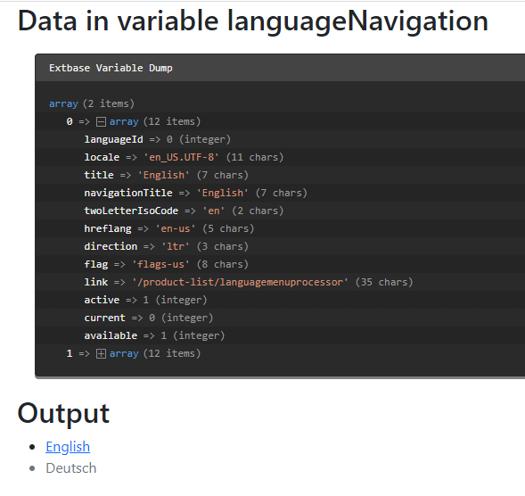

.. include:: /Includes.txt
.. _LanguageMenuProcessor:

=====================
LanguageMenuProcessor
=====================

This menu processor generates a json encoded menu string that will be
decoded again and assigned to the :ts:`FLUIDTEMPLATE` as variable.

Options:
========

.. confval:: if

   :Required: false
   :type: :ref:`if` condition
   :default: ""

   If the condition is not met the data is not processed

.. confval:: languages

   :Required: true
   :type: string, :ref:`stdWrap`
   :default: "auto"
   :Example: "0,1,2"

   A list of comma separated language IDs (e.g. 0,1,2) to use
   for the menu creation or `auto` to load from site configuration

.. confval:: addQueryString.exclude

   :Required: true
   :type: string, :ref:`stdWrap`
   :default: ""
   :Example: "gclid,contrast"

   A list of comma separated parameter names to be excluded from
   the language menu urls.

.. confval:: as

   :Required: false
   :type: string
   :default: defaults to the fieldName

   The variable's name to be used in the Fluid template

Example: Menu of all language from site configuration
=====================================================

Please see also :ref:`dataProcessing-about-examples`.

TypoScript
----------

Using the :php:`LanguageMenuProcessor` the following scenario is possible::

   tt_content {
      examples_dataproclang =< lib.contentElement
      examples_dataproclang {
         templateName = DataProcLangMenu
         dataProcessing.10 = TYPO3\CMS\Frontend\DataProcessing\LanguageMenuProcessor
         dataProcessing.10 {
            languages = auto
            as = languageNavigation
         }
      }
   }

The Fluid template
------------------

This generated menu can be used in Fluid like this:

.. code-block:: html

   <html data-namespace-typo3-fluid="true" xmlns:f="http://typo3.org/ns/TYPO3/CMS/Fluid/ViewHelpers">
      <h2>Data in variable languageNavigation</h2>
      <f:debug inline="true">{languageNavigation}</f:debug>

      <h2>Output</h2>
      <f:if condition="{languageNavigation}">
         <ul id="language" class="language-menu">
            <f:for each="{languageNavigation}" as="item">
               <li class="{f:if(condition: item.active, then: 'active')}
                       {f:if(condition: item.available, else: ' text-muted')}">
                  <f:if condition="{item.available}">
                     <f:then>
                        <a href="{item.link}" hreflang="{item.hreflang}"
                           title="{item.navigationTitle}">
                           {item.navigationTitle}
                        </a>
                     </f:then>
                     <f:else>
                        {item.navigationTitle}
                     </f:else>
                  </f:if>
               </li>
            </f:for>
         </ul>
      </f:if>

   </html>

Output
------

The array now contains information on all language as defined in the site
configuration. As the current page is not translated into German, the
German language has the :php:`item.available` set to false. It therefore
doesn't get linked in the template.

