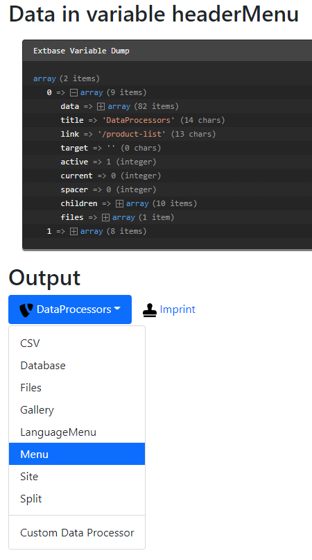

.. include:: /Includes.txt
.. _MenuProcessor:

=============
MenuProcessor
=============

The :php:`MenuProcessor` utilizes :ts:`HMENU` to generate a JSON encoded menu string
that will be decoded again and assigned to :ts:`FLUIDTEMPLATE` as variable.
Additional data processing is supported and will be applied to each record.

Options:
========

.. confval:: levels

   :Required: true
   :type: int, :ref:`stdWrap`
   :default: 1
   :Example: 5

   Maximal number of levels to be included in the output array

.. confval:: expandAll

   :Required: true
   :type: int, :ref:`stdWrap`
   :default: 1
   :Example: 0

   Should all submenus be included or only those of the active pages?

.. confval:: includeSpacer

   :Required: true
   :type: int, :ref:`stdWrap`
   :default: 0
   :Example: 1

   Include pages with type "spacer"

.. confval:: titleField

   :Required: true
   :type: int, :ref:`stdWrap`
   :default: "nav_title // title"
   :Example: "subtitle"

   Fields to be used as title

.. confval:: as

   :Required: false
   :type: string
   :default: "menu"

   Name the variable in the Fluid template will have

.. important:: 
   
   Additionally all :ref:`HMENU options <cobj-hmenu-options>` are available.

Example: Two level menu of the web page
=======================================

Please see also :ref:`dataProcessing-about-examples`.

TypoScript
----------

Using the :php:`MenuProcessor` the following scenario is possible::

   tt_content {
      examples_dataprocmenu =< lib.contentElement
      examples_dataprocmenu {
         templateName = DataProcMenu
         dataProcessing.10 = TYPO3\CMS\Frontend\DataProcessing\MenuProcessor
         dataProcessing.10 {
            levels = 2
            as = headerMenu
            expandAll = 1
            includeSpacer = 1
            titleField = nav_title // title
            dataProcessing {
               10 = TYPO3\CMS\Frontend\DataProcessing\FilesProcessor
               10 {
                  references.fieldName = media
               }
            }
         }
      }
   }

The Fluid template
------------------

This generated menu can be used in Fluid like this:

.. code-block:: html

   <html data-namespace-typo3-fluid="true" xmlns:f="http://typo3.org/ns/TYPO3/CMS/Fluid/ViewHelpers">
      <h2>Data in variable headerMenu</h2>
      <f:debug inline="true">{headerMenu}</f:debug>

      <h2>Output</h2>
      <ul class="nav nav-pills">
         <f:for each="{headerMenu}" as="menuItem">
            <li class="nav-item {f:if(condition:'{menuItem.children}',then:'dropdown')}">
               <f:if condition="{menuItem.children}">
                  <f:then>
                     <!-- Item has children -->
                     <a class="nav-link dropdown-toggle" data-toggle="dropdown" href="#" role="button"
                        aria-haspopup="true" aria-expanded="false">
                        <f:if condition="{menuItem.files}">
                           <f:image image="{menuItem.files.0}" class="" width="20"/>
                        </f:if>
                        {menuItem.title}</a>
                     

                        <f:for each="{menuItem.children}" as="menuItemLevel2">
                           <f:if condition="{menuItemLevel2.spacer}">
                              <f:then>

</f:then>
                              <f:else>
                                 <f:link.page pageUid="{menuItemLevel2.uid}"
                                              class="dropdown-item {f:if(condition:'{menuItemLevel2.active}',then:'active')}">
                                    {menuItemLevel2.title}
                                 </f:link.page>
                              </f:else>
                           </f:if>
                        </f:for>
                     

                  </f:then>
                  <f:else>
                     <!-- Item has no children -->
                     <f:link.page pageUid="{menuItem.data.uid}"  class="nav-link {f:if(condition:'{menuItem.active}',then:'active')}">
                        <f:if condition="{menuItem.files}">
                           <f:image image="{menuItem.files.0}" class="" width="20"/>
                        </f:if>
                        {menuItem.title}
                     </f:link.page>
                  </f:else>
               </f:if>
            </li>
         </f:for>
      </ul>

   </html>

Output
------

The array now contains the menu items on level one. Each item in return has the menu
items of level 2 in an array called :php:`children`.

