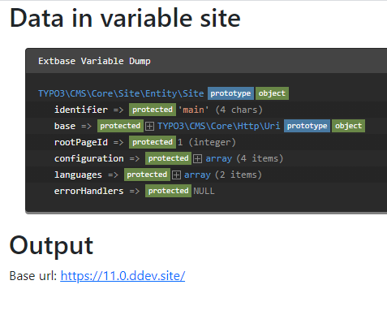

.. include:: /Includes.txt
.. _SiteProcessor:

=============
SiteProcessor
=============

Please see also :ref:`dataProcessing-about-examples`.

TypoScript
----------

The :php:`SiteProcessor` fetches data from the :ref:`site<t3coreapi:sitehandling>`
configuration.

Options:
========

.. confval:: as

   :Required: false
   :type: string
   :default: "site"

   The variable's name to be used in the Fluid template

Example: Output some data from the site configuration
=====================================================

Please see also :ref:`dataProcessing-about-examples`.

TypoScript
----------

Using the :php:`SiteProcessor` the following scenario is possible::

   tt_content {
      examples_dataprocsite =< lib.contentElement
      examples_dataprocsite {
         templateName = DataProcSite
         dataProcessing.10 = TYPO3\CMS\Frontend\DataProcessing\SiteProcessor
         dataProcessing.10 {
            as = site
         }
      }
   }

The Fluid template
------------------

In the Fluid template the properties of the site configuration can be accessed:

.. code-block:: html

   <html data-namespace-typo3-fluid="true" xmlns:f="http://typo3.org/ns/TYPO3/CMS/Fluid/ViewHelpers">
      <h2>Data in variable site</h2>
      <f:debug inline="true">{site}</f:debug>

      <h2>Output</h2>
      
Base url: <f:link.page pageUid="{site.rootPageId}">{site.configuration.base}</f:link.page>

   </html>

Output
------

The array now contains the information from the site configuration:

