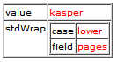
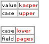

.. ==================================================
.. FOR YOUR INFORMATION
.. --------------------------------------------------
.. -*- coding: utf-8 -*- with BOM.

.. include:: ../../Includes.txt

.. _cobjects-general-information:

General information
^^^^^^^^^^^^^^^^^^^

.. _cobjects-php:

PHP information
"""""""""""""""

The content objects (cObjects) are primarily controlled by the PHP-
script "typo3/sysext/frontend/Classes/ContentObject/ContentObjectRenderer.php"
("typo3/sysext/cms/tslib/class.tslib\_content.php"). The PHP-
class is named "ContentObjectRenderer" ("tslib\_cObj") and often this is also
the variable-name of the objects ($cObj).

The $cObj in PHP has an array, $this->data, which holds records of
various kind. See data type "getText".

This record is normally "loaded" with the record from a table
depending on the situation. Say if you are creating a menu it's often
loaded with the page-record of the actual menuitem or if it's about
content-rendering it'll be the content-record.

.. _reusing-cobjects:

REUSING cOBJECTS
""""""""""""""""

When dealing with "cObjects", you're allowed to use a special syntax
in order to reuse cObjects without actually creating a copy. This has
the advantage of minimizing the size of the cached template. But on
the other hand it doesn't give you the flexibility of overriding
values.

This example will show you how it works::

   #
   # Temporary objects are defined:
   #
   lib.stdheader = COA
   lib.stdheader {
     stdWrap.wrapAlign.field = header_position
     stdWrap.typolink.parameter.field = header_link
     stdWrap.fieldRequired = header

     1 = TEXT
     1.current = 1
     1.fontTag = {$content.wrap.header1}

     stdWrap.space = {$content.headerSpace}
   }

   #
   # CType: header
   #
   tt_content.header = COA
   tt_content.header {
     10 < lib.stdheader
     10.stdWrap.space >

     20 = TEXT
     20.field = subheader
     20.fontTag = {$content.wrap.subheader1}
   }

   #
   # CType: bullet
   #
   tt_content.bullets = COA
   tt_content.bullets {
     10 = < lib.stdheader
     20 < styles.content.bulletlist_gr
   }

First lib.stdheader is defined. This is (and must be) a cObject! (In
this case it is COA.)

Now  *lib.stdheader* is copied to  *tt\_content.header.10* with the
"<" operator. This means that an actual copy of  *lib.stdheader* is
created at  *parsetime* .

But this is not the case with  *tt\_content.bullets.10* . Here
lib.stdheader is just pointed to and lib.stdheader will be used as the
cObject at  *runtime* .

The reason why lib.stdheader was copied in the first case is the fact
that it's needed to unset ".stdWrap.space" inside the cObject
("10.stdWrap.space >"). This could NOT be done in the second case
where only a pointer is created.

.. _reusing-cobjects-temp-objects:

**NOTE:**
~~~~~~~~~

If  *lib.stdheader* was  *temp.stdheader* instead, the pointer would
not work! This is due to the fact that the runtime-reference would
find nothing in "temp." as this is unset before the template is stored
in cache!

This goes for "temp." and "styles." (see the toplevel object
definition elsewhere).

Overriding values anyway:

Although you cannot override values TypoScript-style (using the
operators and all) the properties of the object which has the
reference will be merged with the configuration of the reference.

.. _reusing-cobjects-examples:

Example:
~~~~~~~~

::

   page.10 = TEXT
   page.10.value = kasper
   page.10.case = upper

   page.20 = < page.10
   page.20.case = lower
   page.20.value >
   page.20.field = pages

The result is this configuration:

Notice that .value was not cleared (the red line), because it's simply
two arrays which are joined:

So hence the red line in the above example is useless.

