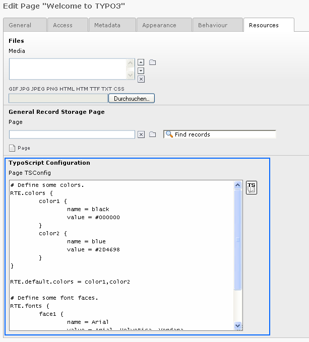
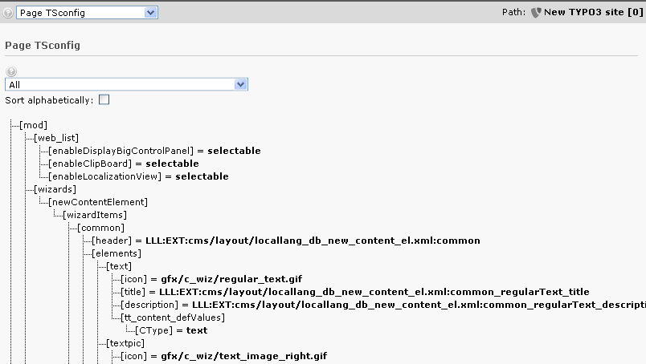

.. ==================================================
.. FOR YOUR INFORMATION
.. --------------------------------------------------
.. -*- coding: utf-8 -*- with BOM.

.. include:: ../../Includes.txt

The "TSconfig" field
^^^^^^^^^^^^^^^^^^^^

This is an example of the TSconfig field with a snippet of
configuration for the Rich Text Editor. Precisely the Rich Text Editor
is quite a good example of the usefulness of 'Page TSconfig'. The
reason is that you may need the RTE to work differently in different
parts of the website. For instance you might need to offer other
style-classes in certain parts of the website. Or some options might
need to be removed in other parts. The 'Page TSconfig' is used to
configure this.

The "TSconfig" field here is available in the tab called "Resources":

Verifying the final configuration
^^^^^^^^^^^^^^^^^^^^^^^^^^^^^^^^^

If you need to check out the actual configuration for a certain branch
in the website, use the 'Web > Info' module (provided by the extension
"info\_pagetsconfig"):

Setting default Page TSconfig
^^^^^^^^^^^^^^^^^^^^^^^^^^^^^

Page TSconfig is designed to be individual for branches of the page
tree. However it can be very handy to set global values that will be
initialized from the root of the tree.

In extensions this is easily done by the extension API function,
t3lib\_extMgm::addPageTSConfig(). In the (ext\_)localconf.php file you
can call it like this to set default configuration::

   t3lib_extMgm::addPageTSConfig('
       RTE.default {
           proc.preserveTables = 1
           showButtons = cut,copy,paste,fontstyle,fontsize,textcolor
           hideButtons = class,user,chMode
       }
   ');

This API function simply adds the content to
$TYPO3\_CONF\_VARS['BE']['defaultPageTSconfig'].