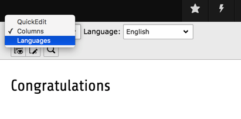
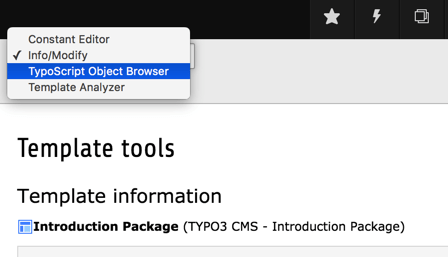

.. include:: ../../Includes.txt

.. _pagemod:

->MOD
^^^^^

Configuration for backend modules. Generally the syntax is
*[module\_name].[property]*. The module name is defined in the
ext\_tables.php file, inside the
:code:`\TYPO3\CMS\Core\Utility\ExtensionManagementUtility::addModule()`
call with the key name :code:`name`.

.. _pageblindingfunctionmenuoptions:

Blinding Function Menu options in Backend Modules
"""""""""""""""""""""""""""""""""""""""""""""""""

Most of the modules in TYPO3 have a "function menu" selector box and
this menu is usually configurable so you are able to remove menu items
in specific sections of the page tree (or by overriding via User
TSconfig, you could disable an option totally for a specific
user/group).

In this case the main menu of the Web > Info module looks like this:

   Function menu in the Web > Info module for the Introduction Package

By adding this Page TSconfig we can remove the "Page TSconfig" item

.. code-block:: typoscript

   mod.web_info.menu.function {
      TYPO3\CMS\InfoPagetsconfig\Controller\InfoPageTyposcriptConfigController = 0
   }

so that we now have:

.. figure:: ../../Images/FunctionMenuInfoModuleBlindedOption.png
   :alt: The function menu of the Web > Info module with blinded option

   Function menu in the Web > Info module without the Page TSconfig item

The "Page TSconfig" item is simply disabled by setting this Page TSconfig.

All you need to know in order to disable function menu items in the
backend modules is *which* modules support it and what the *key* of
the menu item is.

The modules which support this feature are listed below.

The function menu item keys may change over time. Furthermore it is
impossible to create a complete list of them, since items may be added
by extensions. As such, the best way to find the list of existing
function menu item keys is to use the **SYSTEM > Configuration**
module, in the *$GLOBALS['TBE\_MODULES\_EXT'] (BE Modules Extensions)* view.
This will show you a tree like this:

.. figure:: ../../Images/FunctionMenuKeysList.png
   :alt: List of function keys

   Viewing the list of function keys using the Configuration module

To blind the menu items just copy the keys and set the values
as described in the relevant module descriptions below.

.. warning::

   Blinding Function Menu items is not hardcore access control! All it
   does is hide the possibility of accessing that module functionality
   from the interface. It might be possible for users to hack their way
   around it and access the functionality anyways. You should use the
   option of blinding elements mostly to remove otherwise distracting
   options.

.. _pageblindingfunctionmenuoptions-weblayout:

web\_layout.menu.function
~~~~~~~~~~~~~~~~~~~~~~~~~

This is the function menu of the **WEB > Page** module.

   The default options of the Page module function menu

For this module the function keys are simple numerical:

- "0" for QuickEdit
- "1" for Columns
- "2" for Languages

In order to blind them, the following TSconfig would be used:

.. code-block:: typoscript

   # Disables all items except the "Columns" item:
   mod.web_layout.menu.function {
      0 = 0
      2 = 0
   }

.. _pageblindingfunctionmenuoptions-webinfo:

web\_info.menu.function
~~~~~~~~~~~~~~~~~~~~~~~

This is the function menu of the **WEB > Info** module.

   The default options of the Info module function menu

.. code-block:: typoscript

   mod.web_info.menu.function {
         # Disable item "Page Tsconfig"
      TYPO3\CMS\InfoPagetsconfig\Controller\InfoPageTyposcriptConfigController = 0
         Disable item "Log"
      TYPO3\CMS\Belog\Module\BackendLogModuleBootstrap = 0
         # Disable item "Pagetree Overview"
      TYPO3\CMS\Frontend\Controller\PageInformationController = 0
         # Disable item "Localization Overview"
      TYPO3\CMS\Frontend\Controller\TranslationStatusController = 0
   }

.. _pageblindingfunctionmenuoptions-webfunc:

web\_func.menu.function
~~~~~~~~~~~~~~~~~~~~~~~

This is the function menu of the **WEB > Functions** module.

.. figure:: ../../Images/FunctionMenuFunctionsModule.png
   :alt: The function menu of the Functions module

   The default options of the Functions module function menu

.. code-block:: typoscript

   # Disables the item "Sort pages":
   mod.web_func.menu.function {
      TYPO3\CMS\WizardSortpages\View\SortPagesWizardModuleFunction = 0
   }

.. _pageblindingfunctionmenuoptions-webts:

web\_ts.menu.function
~~~~~~~~~~~~~~~~~~~~~

This is the function menu of the **WEB > Template** module.

   The default options of the Template module function menu

.. code-block:: typoscript

   # Disables the item "Template Analyzer":
   mod.web_ts.menu.function {
      TYPO3\CMS\Tstemplate\Controller\TemplateAnalyzerModuleFunctionController = 0
   }

.. _pageoverridingpagetsconfigwithusertsconfig:

Overriding Page TSconfig with User TSconfig
"""""""""""""""""""""""""""""""""""""""""""

In all standard modules the Page TSconfig values of the "mod." branch
may be overridden by the same branch of values set for the backend
user.

To illustrate this feature let's consider the case from above where a
menu item in the Web > Info module was disabled in the Page TSconfig
with this value

.. code-block:: typoscript

   mod.web_info.menu.function {
      tsconf = 0
   }

If however we activate this configuration in the TSconfig of a certain
backend user (e.g. the admin user), that user would still be able to
select this menu item because the value of his User TSconfig overrides
the same value set in the Page TSconfig

.. code-block:: typoscript

   mod.web_info.menu.function {
      tsconf = 1
   }

.. figure:: ../../Images/manual_html_m6b2884ce.png
   :alt: Example 1: Overriding the Page TSconfig menu function

Here is another example: The value of
'mod.web\_layout.editFieldsAtATime' has been set to '1' in Page
TSconfig. Additionally it is also set in the User TSconfig of the
user, who is currently logged in, but there to the value '5'. The
upper image shows you how to check the Page TSconfig. In the lower
image you see the result of this user's User TSconfig: It overrides
the Page TSconfig and alters the configuration:

.. figure:: ../../Images/manual_html_748558d0.png
   :alt: Example 2: Overriding the Page TSconfig menu function

.. _pagesharedotionsformodules:

Shared options for modules (mod.SHARED)
"""""""""""""""""""""""""""""""""""""""

.. ### BEGIN~OF~TABLE ###

.. container:: table-row

   Property
         colPos\_list

   Data type
         *(list of integers)*

   Description
         This option lets you specify which columns of tt\_content elements
         should be displayed in the 'Columns' view of the modules, in
         particular Web > Page.

         By default there are four columns, Left, Normal, Right, Border.
         However most websites use only the Normal column, maybe another also.
         In that case the remaining columns are not needed. By this option you
         can specify exactly which of the columns you want to display.

         If used on top of Backend Layouts, this setting controls which columns
         are editable. Columns configured in the Backend Layout which are not
         listed here, will be displayed with placeholder area.

         Each column has a number which ultimately comes from the configuration
         of the table tt\_content, field 'colPos' found in the tables.php file.
         These are the values of the four default columns used in the default
         Backend Layout:

         Left: 1

         Normal: 0

         Right: 2

         Border: 3

         **Example:**

         This results in only the Normal and Border column being displayed

         .. code-block:: typoscript

            mod.SHARED.colPos_list = 0,3

         .. note::

            Since TYPO3 6.0 mod.SHARED.colPos_list was no longer working.
            Use Backend Layouts instead.

            In TYPO3 CMS 6.2, this setting was reintroduced and affects Backend Layouts.

         .. _example_for_backend_layout:

         **Example for a Backend Layout**

         * Create a record of type "Backend Layout"
           (e.g. in the root page of your website).

         * Add a title (e.g. My Layout).

         * Add in field "Config" the following configuration:

         .. tip::

            You can use the wizard next to the configuration field as a help.

         .. code-block:: typoscript

            backend_layout {
               colCount = 2
               rowCount = 1
               rows {
                  1 {
                     columns {
                        1 {
                           name = Left
                           colPos = 1
                        }
                        2 {
                           name = Content
                           colPos = 0
                        }
                     }
                  }
               }
            }

         * Click on the root page of your website.

         * Click Page Properties > Appearance.

         * Select the new Backend Layout for this page and for the subpages.
           This way the new Backend Layout will be preselected for all subpages
           (also for new ones).

         * Now the columns with colPos=1 and colPos=0 are displayed, labeled
           with "Left" and "Content".

         .. figure:: ../../Images/simpleBackendLayout.png
            :alt: A simple Backend Layout

   Default
         1,0,2,3

.. container:: table-row

   Property
         defaultLanguageLabel

   Data type
         string

   Description
         Alternative label for "Default" when language labels are shown in the
         interface.

         Used in Web > List, Web > Page and TemplaVoilà page module.

.. container:: table-row

   Property
         defaultLanguageFlag

   Data type
         string

   Description
         Filename of the file with the flag icon for the default language. Do
         not use the complete filename, but only the name without dot and
         extension. The file is taken from :file:`typo3/sysext/t3skin/images/flags/`.

         Used in Web > List and TemplaVoilà page module.

         **Example:** This will show the German flag.

         .. code-block:: typoscript

            mod.SHARED {
               defaultLanguageFlag = de
               defaultLanguageLabel = deutsch
            }

         .. tip::

            You can specify "multiple" for the multi-language flag.
            In general: Use the "Select flag icon" selector of a language
            record in the backend to find out what names are available.

            .. figure:: ../../Images/SelectFlagIcon.png

               The flag selector of a language record in the backend -
               a handy way to find out what flag names are available

         .. note::

            Use the file name without dot and extension.

.. container:: table-row

   Property
         disableLanguages

   Data type
         string

   Description
         Comma-separated list of language UID which will be disabled in the
         given page tree.

.. ###### END~OF~TABLE ######

[page:mod.SHARED; beuser:mod.SHARED]

.. _pagewebpage:

Web > Page (mod.web\_layout)
""""""""""""""""""""""""""""

.. ### BEGIN~OF~TABLE ###

.. container:: table-row

   Property
         preview

   Data type
         string

   Description
         It is possible to render previews of your own content elements in the page module.
         By referencing a simple Fluid template you can create a visual representation of your
         content element, making it easier for an editor to understand what is going on on
         the page.

         The syntax is as follows:

         .. code-block:: typoscript

            mod.web_layout.tt_content.preview.[CTYPE].[list_type value] = EXT:site_mysite/Resources/Private/Templates/Preview/ExamplePlugin.html

         This way you can even switch between previews for your plugins by supplying `list` as CType.

         **Example:**

         .. code-block:: typoscript

            mod.web_layout.tt_content.preview.text = EXT:site_mysite/Resources/Private/Templates/Preview/Text.html
            mod.web_layout.tt_content.preview.table = EXT:site_mysite/Resources/Private/Templates/Preview/Table.html
            mod.web_layout.tt_content.preview.list.tx_news = EXT:site_mysite/Resources/Private/Templates/Preview/TxNews.html

.. container:: table-row

   Property
         allowInconsistentLanguageHandling

   Data type
         *boolean*

   Description
         By default, TYPO3 will not allow you to mix translated content and independent content in the page module.
         Content elements violating this behavior will be marked in the Page Module and there is no UI control allowing
         you to create independent content elements in a given language.

         If you want to go back to the old, inconsistent behavior, you can toggle it back on via this switch.

         **Example:**

         Allows to set TYPO3s page module back to inconsistent language mode

         .. code-block:: typoscript

            mod.web_layout.allowInconsistentLanguageHandling = 1

.. container:: table-row

   Property
         tt\_content.colPos\_list

   Data type
         *(list of integers)*

   Description
         See mod.SHARED.colPos\_list for details.

         If non-blank, this list will override the one set by
         mod.SHARED.colPos\_list.

         **Example:**

         This results in only the Normal and Border column being displayed

         .. code-block:: typoscript

            mod.web_layout.tt_content.colPos_list = 0,3

.. container:: table-row

   Property
         editFieldsAtATime

   Data type
         positive integer

   Description
         Specifies the number of subsequent content elements to load in the
         edit form when clicking the edit icon of a content element in the
         'Columns' view of the module.

         **Example:**

         .. code-block:: typoscript

            mod.web_layout {
               editFieldsAtATime = 2
            }

   Default
         1

.. container:: table-row

   Property
         noCreateRecordsLink

   Data type
         boolean

   Description
         If set, the link in the bottom of the page, "Create new record", is
         hidden.

   Default
         0

.. container:: table-row

   Property
         QEisDefault

   Data type
         boolean

   Description
         If set, then the QuickEditor is the first element in the Function Menu
         in the top of the menu in Web > Page

   Default
         0

.. container:: table-row

   Property
         disableSearchBox

   Data type
         boolean

   Description
         Disables the search box in Columns view.

   Default
         0

.. container:: table-row

   Property
         disableAdvanced

   Data type
         boolean

   Description
         Disables the clear cache advanced function in the bottom of the page
         in the module, including the "Create new record" link. As well removes
         the "Clear cache for this page" icon in the right top of the page
         module.

   Default
         0

.. container:: table-row

   Property
         disableNewContentElementWizard

   Data type
         boolean

   Description
         Disables the fact that the new-content-element icons links to the
         content element wizard and not directly to a blank "NEW" form.

.. container:: table-row

   Property
         defaultLanguageLabel

   Data type
         string

   Description
         Alternative label for "Default" when language labels are shown in the
         interface.

         Overrides the same property from mod.SHARED if set.

.. container:: table-row

   Property
         defLangBinding

   Data type
         boolean

   Description
         If set, translations of content elements are bound to the default
         record in the display. This means that within each column with content
         elements any translation found for exactly the shown default content
         element will be shown in the language column next to.

         This display mode should be used depending on how the frontend is
         configured to display localization. The frontend must display
         localized pages by selecting the default content elements and for each
         one overlay with a possible translation if found.

   Default
         0

.. container:: table-row

   Property
         disableIconToolbar

   Data type
         boolean

   Description
         Disables the topmost icon toolbar with the "view"-Icon and the icon
         toolbar below.

.. container:: table-row

   Property
         localization.enableCopy

   Data type
         boolean
         
   Default
         1

   Description
         Enables the creation of copies of content elements into languages in the translation wizard ("free mode").

   Example
         .. code-block:: typoscript

            mod.web_layout {
               localization.enableCopy = 0
            }

.. container:: table-row

   Property
         localization.enableTranslate

   Data type
         boolean

   Default
         1
   
   Description
         Enables simple translations of content elements in the translation wizard ("connected mode").

   Example
         .. code-block:: typoscript

            mod.web_layout {
               localization.enableTranslate = 0
            }

.. container:: table-row

   Property
         BackendLayouts

   Data type
         array

   Description
         Define backend layouts without database records.

         **Example:**

         .. code-block:: typoscript

            mod.web_layout.BackendLayouts {
               exampleKey {
                  title = Example
                  config {
                     backend_layout {
                        colCount = 1
                        rowCount = 2
                        rows {
                           1 {
                              columns {
                                 1 {
                                    name = LLL:EXT:frontend/Resources/Private/Language/locallang_ttc.xlf:colPos.I.3
                                    colPos = 3
                                    colspan = 1
                                 }
                              }
                           }
                           2 {
                              columns {
                                 1 {
                                    name = Main
                                    colPos = 0
                                    colspan = 1
                                 }
                              }
                           }
                        }
                     }
                  }
                  icon = EXT:example_extension/Resources/Public/Images/BackendLayouts/default.gif
               }
            }

.. ###### END~OF~TABLE ######

[page:mod.web\_layout; beuser:mod.web\_layout]

.. _pageweblist:

Web > List (mod.web\_list)
""""""""""""""""""""""""""

.. ### BEGIN~OF~TABLE ###

.. container:: table-row

   Property
         noCreateRecordsLink

   Data type
         boolean

   Description
         If set, the link in the bottom of the page, "Create new record", is
         hidden.

         **Example:**

         .. code-block:: typoscript

            mod.web_list {
               noCreateRecordsLink = 1
            }

   Default
         0

.. container:: table-row

   Property
         disableSingleTableView

   Data type
         boolean

   Description
         If set, then the links on the table titles which shows a single table
         listing only will not be available (including sorting links on columns
         titles, because these links jumps to the table-only view).

.. container:: table-row

   Property
         listOnlyInSingleTableView

   Data type
         boolean

   Description
         If set, the default view will not show the single records inside a
         table anymore, but only the available tables and the number of records
         in these tables. The individual records will only be listed in the
         single table view, that means when a table has been clicked. This is
         very practical for pages containing many records from many tables!

         **Example:**

         .. code-block:: typoscript

            mod.web_list {
               listOnlyInSingleTableView = 1
            }

         The result will be that records from tables are only listed in the
         single-table mode:

         .. figure:: ../../Images/manual_html_165a5551.png
            :alt: The list module after activating the single-table mode

   Default
         0

.. container:: table-row

   Property
         noExportRecordsLinks

   Data type
         boolean

   Description
         If set, the "Export" and "Download CSV file" buttons are
         hidden in single table view inside the list module. This
         option is for example important to disable batch download
         of sensitive data via csv or t3d exports.

         **Example:**

         .. code-block:: typoscript

            mod.web_list {
               noExportRecordsLinks = 1
            }

         The buttons "Export" and "Download CSV file" are hidden
         in single table view inside the list module:

         .. figure:: ../../Images/listModuleWithoutExportButtons.png
            :alt: The list module without export buttons after activating the single-table mode

   Default
         0

.. container:: table-row

   Property
         itemsLimitSingleTable

   Data type
         positive integer

   Description
         Set the default maximum number of items to show in single table view.

   Default
         100

.. container:: table-row

   Property
         itemsLimitPerTable

   Data type
         positive integer

   Description
         Set the default maximum number of items to show per table.

   Default
         20

.. container:: table-row

   Property
         noViewWithDokTypes

   Data type
         string

   Description
         Hide view icon for the defined doktypes (comma-separated)

   Default
         254,255

.. container:: table-row

   Property
         hideTables

   Data type
         *(list of table names)* or `*`

   Description
         Hide these tables in record listings (comma-separated)

         If `*` is used, all tables will be hidden

.. container:: table-row

   Property
         table.[*table name*].hideTable

   Data type
         boolean

   Description
         If set to non-zero, the table is hidden. If it is zero, table is shown
         no matter if table name is listed in "hideTables" list.

         **Example:**

         .. code-block:: typoscript

            mod.web_list.table.tt_content.hideTable = 1

.. container:: table-row

   Property
         hideTranslations

   Data type
         *(list of table names)*

   Description
         For tables in this list all their records in
         additional website languages will be hidden in the List module. Only
         records in default website languages are visible.

         Use "\*" to hide all records of additional website languages in all
         tables or choose tables by comma-separated list.

         **Example:**

         .. code-block:: typoscript

            mod.web_list.hideTranslations = *

         or

         .. code-block:: typoscript

            mod.web_list.hideTranslations = tt_content,tt_news

.. container:: table-row

   Property
         disableSearchBox

   Data type
         boolean

   Description
         Disables the search box located below the clipboard

   Default
         0

.. container:: table-row

   Property
         searchLevel.items

   Data type
         array

   Description
         Sets labels for each level label in the searchlevel select box

         .. code-block:: typoscript

            mod.web_list.searchLevel.items {
               -1 = EXT:lang/locallang_core.xlf:labels.searchLevel.infinite
               0 = EXT:lang/locallang_core.xlf:labels.searchLevel.0
               1 = EXT:lang/locallang_core.xlf:labels.searchLevel.1
               2 = EXT:lang/locallang_core.xlf:labels.searchLevel.2
               3 = EXT:lang/locallang_core.xlf:labels.searchLevel.3
               4 = EXT:lang/locallang_core.xlf:labels.searchLevel.4
            }

   Default

.. container:: table-row

   Property
         allowedNewTables

   Data type
         *(list of table names)*

   Description
         If this list is set, then only tables listed here will have a link to
         "create new" in the page and subpages.

         This also affects the display of "Create new record",
         typo3/sysext/backend/Classes/Controller/NewRecordController.php.

         .. note::

            Technically records can be created (e.g. by copying/moving),
            so this is "pseudo security". The point is to reduce the number of
            options for new records visually.

         **Example:**

         .. code-block:: typoscript

            mod.web_list {
               allowedNewTables = pages, tt_news
            }

         Only pages and tt\_news table elements will be linked to in the New
         record screen:

         .. figure:: ../../Images/manual_html_6d60e8b.png
            :alt: The New record screen after modifying the allowed elements

.. container:: table-row

   Property
         deniedNewTables

   Data type
         *(list of table names)*

   Description
         If this list is set, then the tables listed here won't have a link to
         "create new record" in the page and subpages. This also affects
         "BackendUtility::getModuleUrl('db_new')" (the display of "Create new record").

         This is the opposite of the previous property "allowedNewTables".

         If allowedNewTables and deniedNewTables contain a common subset,
         deniedNewTables takes precedence.

         **Example:**

         .. code-block:: typoscript

            mod.web_list {
               deniedNewTables = tt_news,tt_content
            }

.. container:: table-row

   Property
         newWizards

   Data type
         boolean

   Description
         If set, then the new-link over the control panel of the pages and
         tt\_content listings in the List module will link to the wizards and
         not create a record in the top of the list.

.. container:: table-row

   Property
         showClipControlPanelsDespiteOfCMlayers

   Data type
         boolean

   Description
         If set, then the control- and clipboard panels of the module is shown
         even if the context-popups (ClickMenu) are available. Normally the
         control- and clipboard panels are disabled (unless extended mode is
         set) in order to save bandwidth.

.. container:: table-row

   Property
         enableDisplayBigControlPanel

   Data type
         *(list of keywords)*

   Description
         Determines whether the checkbox "Extended view" in the list module is
         shown or hidden. If it is hidden, you can predefine it to be always
         activated or always deactivated.

         .. figure:: ../../Images/manual_html_74103dfb.png
            :alt: "Extended view" is shown in the list module

         The following values are possible:

         - activated: The option is activated and the checkbox is hidden.

         - deactivated: The option is deactivated and the checkbox is hidden.

         - selectable: The checkbox is shown so that the option can be selected by the user.

   Default
         selectable

.. container:: table-row

   Property
         enableClipBoard

   Data type
         *(list of keywords)*

   Description
         Determines whether the checkbox "Show clipboard" in the list module is
         shown or hidden. If it is hidden, you can predefine it to be always
         activated or always deactivated.

         The following values are possible:

         - activated: The option is activated and the checkbox is hidden.

         - deactivated: The option is deactivated and the checkbox is hidden.

         - selectable: The checkbox is shown so that the option can be selected by the user.

   Default
         selectable

.. container:: table-row

   Property

         newPageWizard.override

         newContentElementWizard.override

   Data type
         string

   Description
         If set to an extension key, (e.g. "templavoila"), then the specified module or route  will be used for creating
         new elements on the page. "newContentElementWizard" will likewise use the defined module or route for creating
         new content elements.

         Also see "options.overridePageModule".

         **Example:**

         .. code-block:: typoscript

            mod.newContentElementWizard.override = my_custom_module
            mod.newContentElementWizard.override = my_module_route

.. container:: table-row

   Property
         clickTitleMode

   Data type
         string

   Description
         Keyword which defines what happens when a user clicks the title in the
         list.

         Keywords:

         **edit** = Edits record

         **info** = Shows information

         **show** = Shows page/content element in frontend

   Default
         edit

.. container:: table-row

   Property
         tableDisplayOrder.[*table name*]

   Data type
         array

   Description
         Flexible configuration of the order in which tables are displayed.

         The keywords ``before`` and ``after`` can be used to specify an order relative to other table names.

         **Example:**

         .. code-block:: typoscript

            mod.web_list.tableDisplayOrder.<tableName> {
              before = <tableA>, <tableB>, ...
              after = <tableA>, <tableB>, ...
            }

.. ###### END~OF~TABLE ######

[page:mod.web\_list; beuser:mod.web\_list]

.. _pagewebview:

Web > View (mod.web\_view)
""""""""""""""""""""""""""

.. ### BEGIN~OF~TABLE ###

.. container:: table-row

   Property
         type

   Data type
         positive integer

   Description
         Enter the value of the &type parameter passed to the webpage.

         **Example:**

         By this configuration frontend pages will be shown with
         "index.php?id=123&type=1" from the Web > View module

         .. code-block:: typoscript

            mod.web_view {
               type = 1
            }

.. container:: table-row

   Property
         previewFrameWidths

   Data type
         array

   Description
         Configure available presets in view module.

         **<key>.label** Label for the preset

         **<key>.type** Category of the preset, must be one of `desktop`, `tablet` or `mobile`

         **<key>.width** Width of the preset

         **<key>.height** Height of the preset

         **Example:**

         With this configuration a new preset with size 1027x768 will be configured with a label loaded from an
         xlf file and the category `desktop`.

         .. code-block:: typoscript

             mod.web_view.previewFrameWidths {
                <key>.label = LLL:EXT:viewpage/Resources/Private/Language/locallang.xlf:computer
                <key>.type = desktop
                <key>.width = 1024
                <key>.height = 768
             }

         .. figure:: ../../Images/WebViewTSConfigPreview.png
            :alt: Dropdown menu Width with added frame size called myPreview

.. ###### END~OF~TABLE ######

[page:mod.web\_view; beuser:mod.web\_view]

Wizards (mod.wizards)
"""""""""""""""""""""

Wizards make it possible to customize the new record wizard or the new
content element wizard, for example.

.. _pagewebrecordwizard:

New record wizard (mod.wizards.newRecord)
~~~~~~~~~~~~~~~~~~~~~~~~~~~~~~~~~~~~~~~~~

.. ### BEGIN~OF~TABLE ###

.. container:: table-row

   Property
         pages

   Data type
         boolean

   Description
         Use the following sub-properties to show or hide the
         specified links.

         **Available sub-properties:**

         show.pageAfter
           Show or hide the link to create new pages after
           the selected page.

         show.pageInside
           Show or hide the link to create new pages inside
           the selected page.

         show.pageSelectPosition
           Show or hide the link to create new pages
           at a selected position.

         Setting any of these properties to 0 will hide the corresponding link,
         but setting to 1 will leave it visible.

         **Example:**

         .. code-block:: typoscript

            mod.wizards.newRecord.pages.show {
               pageInside = 0
            }

         Hides the "Page (inside)" link.

         .. figure:: ../../Images/manual_html_44865d7b.png
            :alt: The modified New record screen without Page (inside)

   Default
         1

.. container:: table-row

   Property
         order

   Data type
         *(list of values)*

   Description
         Define an alternate order for the groups of records in the new records
         wizard. Pages and content elements will always be on top, but the
         order of other record groups can be changed.

         Records are grouped by extension keys, plus the special key "system"
         for records provided by the TYPO3 Core.

         **Example:**

         .. code-block:: typoscript

            mod.wizards.newRecord.order = tt_news

         This places the tt\_news group at the top (after pages and content
         elements). The other groups follow unchanged:

         .. figure:: ../../Images/manual_html_1c6e46bb.png
            :alt: The position of News changed after modifying the New record screen

.. ###### END~OF~TABLE ######

[page:mod.wizards.newRecord; beuser:page.mod.wizards.newRecord]

.. _pagenewcontentelementwizard:

New content element wizard (mod.wizards.newContentElement)
~~~~~~~~~~~~~~~~~~~~~~~~~~~~~~~~~~~~~~~~~~~~~~~~~~~~~~~~~~

.. ### BEGIN~OF~TABLE ###

.. container:: table-row

   Property
         wizardItems.[group]

   Data type
         array

   Description
         In the new content element wizard, content element types are grouped
         together by type. Each such group can be configured independently. The
         four default groups are: "common", "special", "forms" and "plugins".

         The configuration options below apply to any group.

.. container:: table-row

   Property
         wizardItems.[group].before

   Data type
         string

   Description
         Sorts [group] in front of the group given. The four default groups are: "common", "special", "forms" and "plugins".

.. container:: table-row

   Property
         wizardItems.[group].after

   Data type
         string

   Description
         Sorts [group] next to the group given. The four default groups are: "common", "special", "forms" and "plugins".

.. container:: table-row

   Property
         wizardItems.[group].header

   Data type
         string (localized)

   Description
         Name of the group.

.. container:: table-row

   Property
         wizardItems.[group].show

   Data type
         string

   Description
         Comma-separated list of items to show in the group. Use "\*" to show
         all.

         **Example:**

         .. code-block:: typoscript

            # Hide bulletList
            mod.wizards.newContentElement.wizardItems.common.show := removeFromList(bullets)
            # Only show text and textpic in common
            mod.wizards.newContentElement.wizardItems.common.show = text,textpic

.. container:: table-row

   Property
         wizardItems.[group].elements

   Data type
         array

   Description
         List of items in the group.

.. container:: table-row

   Property
         wizardItems.[group].elements.[name]

   Data type
         array

   Description
         Configuration for a single item.

.. container:: table-row

   Property
         wizardItems.[group].elements.[name].iconIdentifier

   Data type
         string

   Description
         The icon identifier of the icon you want to display.

.. container:: table-row

   Property
         wizardItems.[group].elements.[name].title

   Data type
         string (localized)

   Description
         Name of the item.

.. container:: table-row

   Property
         wizardItems.[group].elements.[name].description

   Data type
         string (localized)

   Description
         Description text for the item.

.. container:: table-row

   Property
         wizardItems.[group].elements.[name].tt\_content\_defValues

   Data type
         array

   Description
         Default values for tt\_content fields.

.. ###### END~OF~TABLE ######

[page:mod.wizards.newContentElement;
beuser:mod.wizards.newContentElement]

.. _pageexample1:

Example 1:
~~~~~~~~~~

Add a new element (header) to the "common" group

.. code-block:: typoscript

   mod.wizards.newContentElement.wizardItems.common.elements.header {
      icon = gfx/c_wiz/regular_text.gif
      title = Header
      description = Adds a header element only
      tt_content_defValues {
         CType = header
      }
   }
   mod.wizards.newContentElement.wizardItems.common.show := addToList(header)

.. _pageexample2:

Example 2:
~~~~~~~~~~

Create a new group and add a (pre-filled) element to it

.. code-block:: typoscript

   mod.wizards.newContentElement.wizardItems.myGroup {
      header = LLL:EXT:cms/layout/locallang.xlf:advancedFunctions
      elements.customText {
         icon = gfx/c_wiz/regular_text.gif
         title = Introductory text for national startpage
         description = Use this element for all national startpages
         tt_content_defValues {
            CType = text
            bodytext (
               <h2>Section Header</h2>
               
Lorem ipsum dolor sit amet, consectetur, sadipisci velit ...

            )
            header = Section Header
            header_layout = 100
         }
      }
   }
   mod.wizards.newContentElement.wizardItems.myGroup.show = customText

This will add the following at the bottom of the new content element
wizard:

