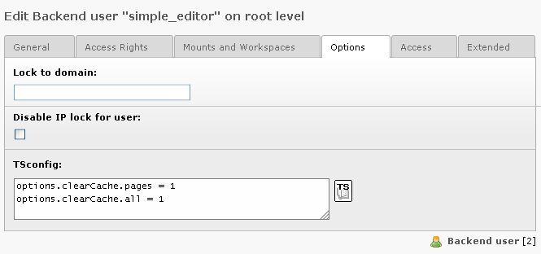
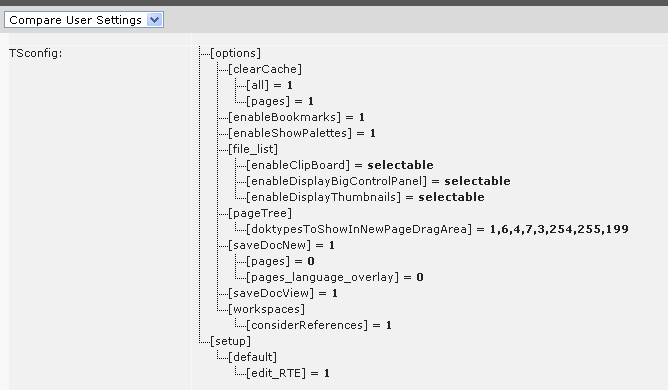

.. ==================================================
.. FOR YOUR INFORMATION
.. --------------------------------------------------
.. -*- coding: utf-8 -*- with BOM.

.. include:: ../../Includes.txt
.. include:: Images.txt

((generated))
^^^^^^^^^^^^^

The "TSconfig" field
""""""""""""""""""""

This is how the TSconfig for users is entered in the backend user
records:

Verifying the final configuration
"""""""""""""""""""""""""""""""""

It's vital to check the resulting configuration of the users. You can
do that in the Tools > User Admin module (which is provided by the
extension "beuser") by clicking a username. Then you'll see the
TSconfig tree among other information. Here's an example:

Overriding previously set options
"""""""""""""""""""""""""""""""""

Now, lets say the user is a member of a  *usergroup* with this
configuration::

   TCAdefaults.tt_content {
     hidden = 1
     header = Hello!
   }

Then setting these values in the TSconfig field of the user himself,
would override the default value of the header (marked red) and add
the clear cache option (marked blue). The default value of the hidden
field is not changed and simply inherited directly from the group::

   TCAdefaults.tt_content.header = 234
   options.clearCache.all = 1

Setting default User TSconfig
"""""""""""""""""""""""""""""

User TSconfig is designed to be individual for users or groups of
users. However it can be very handy to set global values that will be
initialized for all users.

In extensions this is easily done by the extension API function,
t3lib\_extMgm::addUserTSConfig(). In the (ext\_)localconf.phpfile you
can call it like this to set default configuration::

   /**
    * Adding the admin panel to users by default and forcing the display of the edit-icons
    */
   t3lib_extMgm::addUserTSConfig('
   admPanel {
     enable.edit = 1
     module.edit.forceNoPopup = 1
     module.edit.forceDisplayFieldIcons = 1
     module.edit.forceDisplayIcons = 0
     hide = 1
   }
   options.enableBookmarks = 1
   ');

This API function simply adds the content to
$TYPO3\_CONF\_VARS['BE']['defaultUserTSconfig'].

