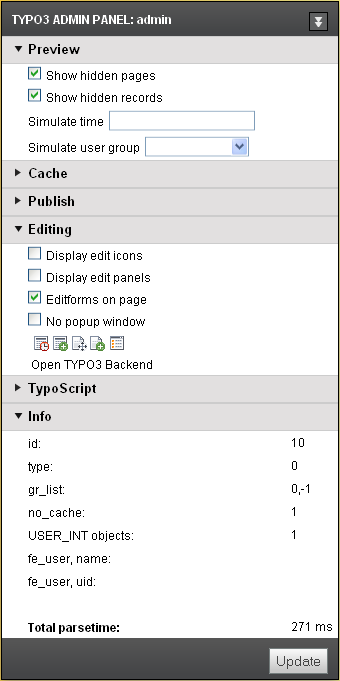

.. ==================================================
.. FOR YOUR INFORMATION
.. --------------------------------------------------
.. -*- coding: utf-8 -*- with BOM.

.. include:: ../../Includes.txt

->ADMPANEL
^^^^^^^^^^

Configuration of the Admin Panel in the Frontend for the user.

.. ### BEGIN~OF~TABLE ###

.. container:: table-row

   Property
         enable

   Data type
         [object]

   Description
         Used to enable the various parts of the panel for users.

         All values are 0/1 booleans.

         **General:**

         .all: enables all modules

         **Modules:**

         .preview

         .cache

         .publish

         .edit

         .tsdebug

         .info

   Default
         (For admin-users, all = 1 is default! Hardcoded in class)

.. container:: table-row

   Property
         hide

   Data type
         boolean

   Description
         If set, the panel will not be displayed in the bottom of the page.
         This only has a visual effect.

.. container:: table-row

   Property
         override

   Data type
         [object]

   Description
         Override all admin panel settings:

         .[modulename].[propertyname]

         **Note:**

         You have to activate a module first by setting

         .modulename = 1

         **Full reference:**

         To find out the name of a modulename/property, you can have a look at
         the HTML code of the admin panel and watch the names of the form
         elements. In this example, the module name is "tsdebug", and the
         property is called "displayTimes":

         *name="TSFE\_ADMIN\_PANEL[tsdebug\_displayTimes]"*

         **Most common options**

         .preview.showHiddenPages (boolean)

         .preview.showHiddenRecords (boolean)

         .preview.simulateDate (timestamp)

         .preview.simulateUserGroup (integer)

         .cache.noCache (boolean)

         .cache.clearCacheLevels (integer)

         .edit.displayFieldIcons (boolean)

         .edit.displayIcons (boolean)

         .edit.editFormsOnPage (boolean)

         .edit.editNoPopup (boolean)

.. container:: table-row

   Property
         module.edit

   Data type
         [object]

   Description
         **Deprecated**, use override.\* instead (see above)!

         **.forceDisplayIcons** (boolean):

         *Forces edit-panels to appear regardless of the selectorbox.*

         **.forceDisplayFieldIcons** (boolean):

         *Forces edit-icons to appear regardless of the selectorbox.*

         **.forceNoPopup** (boolean):

         *Forces edit-forms to open in same window - not pop up window.*

         *Example, that forces the display of the edit icons without displaying
         the admin-panel itself:* ::

            admPanel {
              enable.edit = 1
              module.edit.forceDisplayFieldIcons = 1
              hide = 1
            }

.. ###### END~OF~TABLE ######

[beuser:admPanel]

.. figure:: ../../Images/manual_html_m43fb96d.png
   :alt: TIP

**Tip**

If you want to link to the login-screen of the backend, but wish that
the user should return to the frontend for editing, you do that with
this link, sending the "redirect\_url" parameter to the login-screen.
In that case the backend interface is not started. ::

              <a href="typo3/index.php?redirect_url=../">
                           Backend login returning to frontend
                   </a>

This is what the admin panel looks like. Notice the fact that the
visibility of the admin panel is ultimately depending on being
configured in your TypoScript template for the website! This is easily
done by inserting this string in the TypoScript Template::

      config.admPanel = 1

Or if you use frames, this is probably better::

      page.config.admPanel = 1