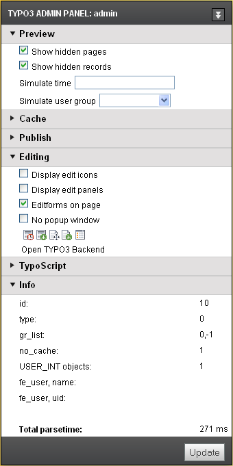

.. include:: /Includes.rst.txt
.. index:: Admin panel
.. _useradmpanel:

admPanel
========

Configuration of the Admin Panel in the Frontend for the user. This is what
the Admin Panel looks like:

For more information about the Admin Panel, see the :ref:`Admin Panel manual
<t3adminpanel:introduction>`.

The visibility of the Admin Panel depends on being configured in your
frontend TypoScript template for the website. You can do this by inserting this
string in the TypoScript Template:

.. code-block:: typoscript

   # Note this is a frontend TypoScript template and not TSconfig!
   config.admPanel = 1

Example user TSconfig to disable the admin panel for a user:

.. code-block:: typoscript

   admPanel.hide = 1

.. index:: Admin panel; enable

enable
------

:aspect:`Datatype`
    [object]

:aspect:`Description`
    Used to enable the various parts of the panel for users. All values are 0/1 booleans.

    Enable / disable all modules:

    .. code-block:: typoscript

        admPanel.enable.all = 1

    Enable / disable single parts of the admin panel:

    .. code-block:: typoscript

        admPanel.enable.preview
        admPanel.enable.cache
        admPanel.enable.publish
        admPanel.enable.edit
        admPanel.enable.tsdebug
        admPanel.enable.info
        admPanel.enable.cache
        admPanel.enable.debug
        admPanel.enable.info
        admPanel.enable.preview
        admPanel.enable.tsdebug
        admPanel.enable.debug_events
        admPanel.enable.debug_log
        admPanel.enable.debug_pagetitle
        admPanel.enable.debug_queryinformation
        admPanel.enable.info_general
        admPanel.enable.info_php
        admPanel.enable.info-request
        admPanel.enable.info_userint
        admPanel.enable.typoscript-waterfall

:aspect:`Default`
    For admin users, `admPanel.enable.all = 1` is default.

    .. note::
       The admin panel is active for all admin users by default. If this does
       not fit the necessary setup, the different modules can be disabled.

.. index:: Admin panel; hide

hide
----

:aspect:`Datatype`
    boolean

:aspect:`Description`
    If set, the panel will not be displayed in the bottom of the page. This only has a visual effect.

.. index:: Admin panel; Settings override

override
--------

:aspect:`Datatype`
    [object]

:aspect:`Description`
    Override single admin panel settings:

    .. code-block:: typoscript

        admPanel.override.[modulename].[propertyname]

    You have to activate a module first by setting

    .. code-block:: typoscript

        admPanel.override.[modulename] = 1

    **Most common options**

    .. code-block:: typoscript

        admPanel.override.preview.showFluidDebug (boolean)
        admPanel.override.preview.showHiddenPages (boolean)
        admPanel.override.preview.showHiddenRecords (boolean)
        admPanel.override.preview.simulateDate (timestamp)
        admPanel.override.preview.simulateUserGroup (integer)
        admPanel.override.cache.noCache (boolean)
        admPanel.override.tsdebug.forceTemplateParsing (boolean)
