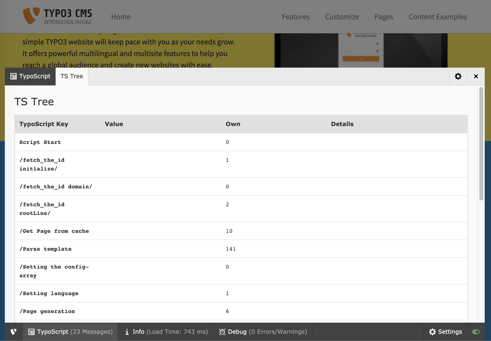

.. include:: ../Includes.txt

.. _useradmpanel:

admPanel
========

Configuration of the Admin Panel in the Frontend for the user.

This is what the admin panel looks like. Notice the fact that the
visibility of the admin panel is ultimately depending on being
configured in your frontentd TypoScript template for the website! This is easily
done by inserting this string in the TypoScript Template:

.. code-block:: typoscript

   # Note this is a frontend TypoScript template and not TSconfig!
   config.admPanel = 1

Example TSconfig to disable the admin panel for a user:

.. code-block:: typoscript

   admPanel.enable = 0

.. note::

    The admin panel code is being rewritten in TYPO3 v9, some of the options
    may be outdated, and most parts may eventually vanish altogether in the future.

.. tip::

   If you want to link to the login-screen of the backend, but wish that
   the user should return to the frontend for editing, you do that with
   this link, sending the "redirect\_url" parameter to the login-screen.
   In that case the backend interface is not started.

   .. code-block:: html

      <a href="typo3/index.php?redirect_url=../">
         Backend login returning to frontend
      </a>

enable
------

:aspect:`Datatype`
    [object]

:aspect:`Description`
    Used to enable the various parts of the panel for users. All values are 0/1 booleans.

    Enable / disable all modules:

    .. code-block:: typoscript

        admPanel.enable.all = 1

    Enable / disable single parts of the admin panel:

    .. code-block:: typoscript

        admPanel.enable.preview
        admPanel.enable.cache
        admPanel.enable.publish
        admPanel.enable.edit
        admPanel.enable.tsdebug
        admPanel.enable.info

:aspect:`Default`
    For admin users, `admPanel.enable.all = 1` is default

hide
----

:aspect:`Datatype`
    boolean

:aspect:`Description`
    If set, the panel will not be displayed in the bottom of the page. This only has a visual effect.

override
--------

:aspect:`Datatype`
    [object]

:aspect:`Description`
    Override single admin panel settings:

    .. code-block:: typoscript

        admPanel.override.[modulename].[propertyname]

    You have to activate a module first by setting

    .. code-block:: typoscript

        admPanel.override.[modulename] = 1

    **Full reference**

    To find out the name of a modulename/property, you can have a look at
    the HTML code of the admin panel and watch the names of the form
    elements. In this example, the module name is "tsdebug", and the
    property is called "displayTimes":

    *name="TSFE\_ADMIN\_PANEL[tsdebug\_displayTimes]"*

    **Most common options**

    .. code-block:: typoscript

        admPanel.override.preview.showHiddenPages (boolean)
        admPanel.override.preview.showHiddenRecords (boolean)
        admPanel.override.preview.simulateDate (timestamp)
        admPanel.override.preview.simulateUserGroup (integer)
        admPanel.override.cache.noCache (boolean)
        admPanel.override.cache.clearCacheLevels (integer)
        admPanel.override.edit.displayFieldIcons (boolean)
        admPanel.override.edit.displayIcons (boolean)
        admPanel.override.edit.editNoPopup (boolean)
        admPanel.override.tsdebug.forceTemplateParsing (boolean)
