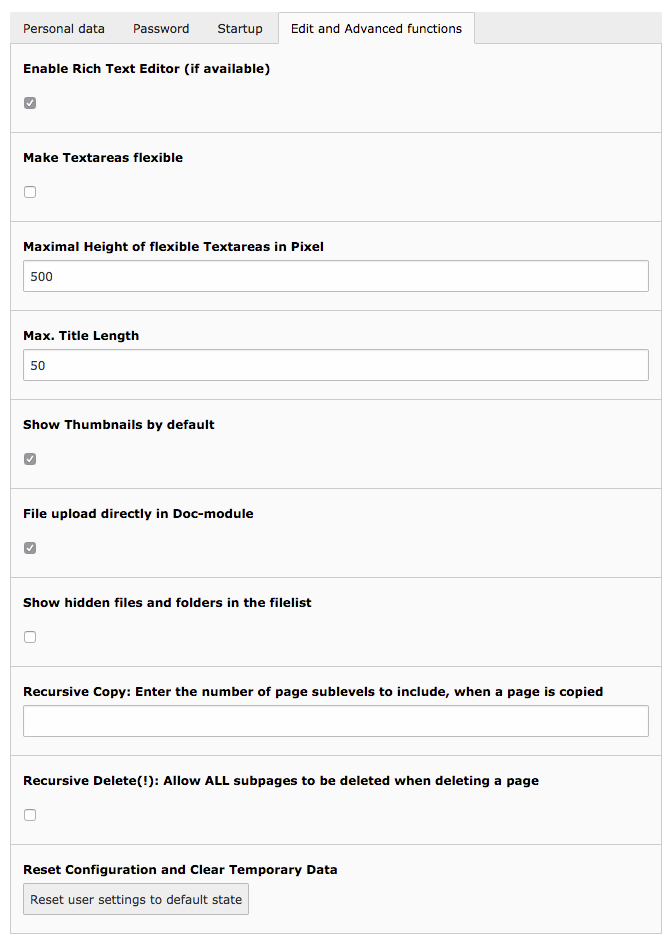

.. include:: ../Includes.txt

.. _usersetup:

=====
setup
=====

Default values and override values for the *User Settings* module.

The "User tools > User settings" module may only represent a subset of the options from the table below.

Properties from the list below are available the different prefixes `setup.default` and `setup.override`,
and there is another prefix to hide single fields:

setup.default.[someProperty]
    This sets *default* values of the property. A user may override these
    using its "User Settings" module. This affects only *new* users who did
    not login yet. It is not usually not possible to set new defaults for users
    who already logged in at least once. The only way to apply new defaults to
    existing users is by "Resetting All Backend User Preferences" in the
    "Admin tools > Maintenance" section of the install tool.

setup.override.[someProperty]
    This forces values for the properties of the list below, a user can not override these
    setting in its "User settings" module. So, overriding values will be impossible for the
    user to change himself and no matter what the current value is, the overriding
    value will overrule it.

    .. attention::

        There is a tricky aspect to these `setup.override`: If first you have set a
        value by `setup.override` and then remove it again, you will experience
        that the value persists to exist. This is because it is saved in the
        backend user's profile. Therefore, if you have once set a value, do
        *not* remove it again but rather set it blank if you want to disable
        the effect again!

setup.fields.[fieldName].disabled
    On top of being able to set default values or override them, it is also possible to
    hide fields in the "User Settings" module, using `setup.fields.[fieldName].disabled = 1`.
    You can find the names of the fields in the "Configuration" module by browsing the "User Settings" array, example:

    .. code-block:: typoscript

        # Do not show the 'emailMeAtLogin' field to the user in "User Settings" module
        setup.fields.emailMeAtLogin.disabled = 1

        # And fore the value of this field to be set to 1
        setup.override.emailMeAtLogin = 1

copyLevels
==========

:aspect:`Datatype`
    positive integer

:aspect:`Description`
    Recursive Copy: Enter the number of page sub-levels to include, when a page is copied

edit_docModuleUpload
====================

:aspect:`Datatype`
    boolean

:aspect:`Description`
    File upload directly in Doc. module

edit_RTE
========

:aspect:`Datatype`
    boolean

:aspect:`Description`
    Enable Rich Text Editor

emailMeAtLogin
==============

:aspect:`Datatype`
    boolean

:aspect:`Description`
    Notify me by email, when somebody logs in from my account

lang
====

:aspect:`Datatype`
    language-key

:aspect:`Description`
    One of the language-keys. For current options see
    :file:`typo3/sysext/core/Classes/Localization/Locales.php`, e.g. `dk`, `de`, `es` etc.

neverHideAtCopy
===============

:aspect:`Datatype`
    boolean

:aspect:`Description`
    If set, then the hideAtCopy feature for records in TCE will not be used.

resizeTextareas
===============

:aspect:`Datatype`
    boolean

:aspect:`Description`
    This option makes textareas resizable. When moving towards the right
    or bottom border of the textarea, the mouse cursor changes to a resize
    cursor. This is active by default.

:aspect:`Default`
    1

resizeTextareas_MaxHeight
=========================

:aspect:`Datatype`
    positive integer

:aspect:`Description`
    Defines the maximal height of textarea (in pixels).

:aspect:`Default`
    600

startModule
===========

:aspect:`Datatype`
    string

:aspect:`Description`
    Name of the module that is called when the user logs into the Backend

titleLen
========

:aspect:`Datatype`
    positive integer

:aspect:`Description`
    Max. Title Length

thumbnailsByDefault
===================

:aspect:`Datatype`
    boolean

:aspect:`Description`
    Show Thumbnails by default
