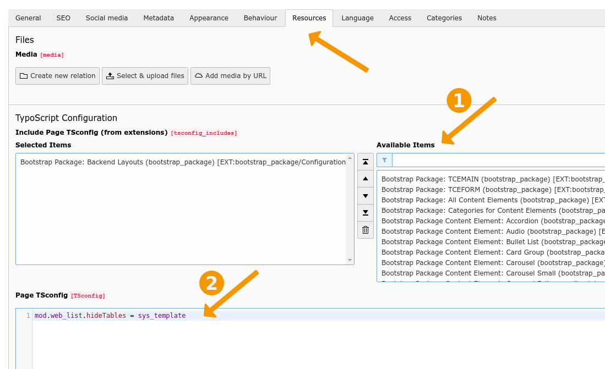
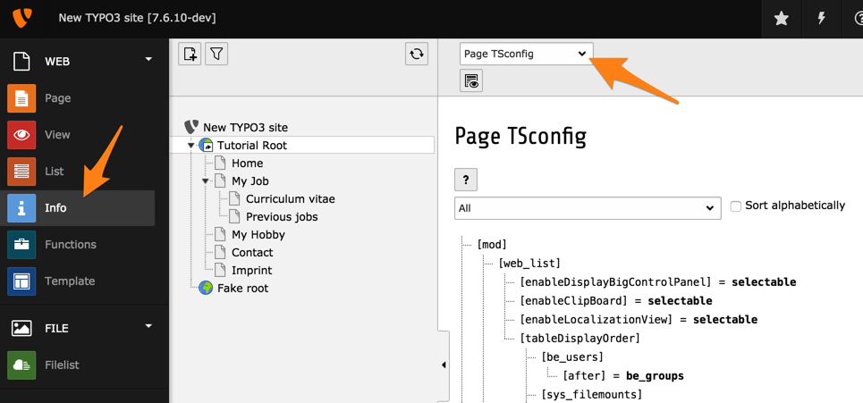
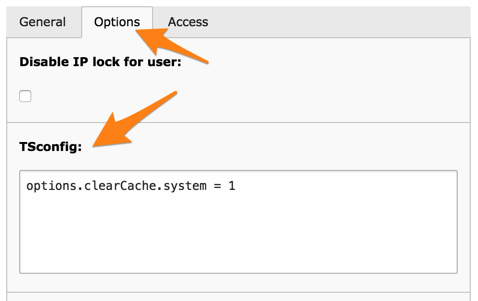

.. include:: ../Includes.txt

.. _typoscript-syntax-using-setting:

==========================
Using and setting TSconfig
==========================

This chapter gives an overview where TSconfig is set, how it
can be edited, and the load order of the different variants.

TSconfig can be used in page, it is then referred to as
"Page TSconfig", or for backend users and backend user groups,
in which case it is known as "User TSconfig".

While the objects, properties and conditions are different,
the *syntax* of TSconfig is basically the same as it is for
TypoScript in frontend TypoScript templates, except for constants,
which are not available in TSconfig.

.. _pagethetsconfigfield:

Page TSconfig
-------------

Entering data
^^^^^^^^^^^^^

There are two ways to attach Page TSconfig to any given page.
When editing a page, move to the "Resources" tab. The first
way is to include a TSconfig file provided by an extension.
The second is to directly enter code in the "Page TSConfig" field.

Page TSconfig is inherited along the page tree. Consider
the TSconfig from the above screenshot:

.. code-block:: typoscript

   mod.web_list.hideTables = sys_template

It means that we want to fully hide the "sys\_template" table
on the page where we defined this TSconfig and **all** of its
child pages.

Page TSconfig is thus very convenient to have separate branches
of the page tree behave differently.

.. _pageverifyingthefinalconfiguration:

Verify the final configuration
^^^^^^^^^^^^^^^^^^^^^^^^^^^^^^

The full Page TSconfig for any given page can be viewed using the
**WEB > Info** module and choosing the "Page TSconfig" action.

.. _pageoverwritingandmodifyingvalues:

Overwriting and modifying values
^^^^^^^^^^^^^^^^^^^^^^^^^^^^^^^^

Properties, which are set in Page TSconfig, are valid for the page, on
which they are set, and for all pages hierarchically below. You can
overwrite and :ref:`modify <t3coreapi:typoscript-syntax-syntax-value-modification>` them
in the Page TSconfig of the same page or a subpage.

Page TSconfig itself can be overwritten by User TSconfig.

.. important::

   It is *not* possible to *modify* Page TSconfig in User TSconfig. Page TSconfig can only be
   :ref:`overwritten in User TSconfig <userrelationshiptovaluessetinpagetsconfig>`.

**Example:**

* Add in Page TSconfig

.. code-block:: typoscript

	RTE.default.showButtons = bold

* You get the value "bold".

* Add later in Page TSconfig

.. code-block:: typoscript

	RTE.default.showButtons := addToList(italic)

* Finally you get the value "bold,italic".

.. _pagesettingdefaultpagetsconfig:

Setting default Page TSconfig
^^^^^^^^^^^^^^^^^^^^^^^^^^^^^

Page TSconfig is designed to be individual for branches of the page
tree. However it can be very handy to set global values that will be
initialized from the root of the tree.

In extensions this is easily done by the extension API function,
:code:`\TYPO3\CMS\Core\Utility\ExtensionManagementUtility::addPageTSConfig()`.
In the :code:`ext_localconf.php` file of your extension you
can call it like this to set default configuration:

.. code-block:: php

	\TYPO3\CMS\Core\Utility\ExtensionManagementUtility::addPageTSConfig('
		RTE.default {
			showButtons = cut,copy,paste,fontstyle,fontsize,textcolor
			hideButtons = class,user,chMode
		}
	');

There is a global `TYPO3_CONF_VARS` value called :code:`$TYPO3_CONF_VARS['BE']['defaultPageTSconfig']`. The API
function above adds content to that array. The array value itself however should **not** be changed or set directly
within :file:`LocalConfiguration.php`. Instead, it is good practice to use the above API method to add your default
Page TSconfig for instance within your project extension that contains other local settings
like templates, frontend TypoScript and so on.

Register static Page TSconfig files
^^^^^^^^^^^^^^^^^^^^^^^^^^^^^^^^^^^

Register PageTS config files in :file:`Configuration/TCA/Overrides/pages.php` of any extension,
which will be shown in the page properties (the same way as TypoScript static templates are included):

.. code-block:: php

   \TYPO3\CMS\Core\Utility\ExtensionManagementUtility::registerPageTSConfigFile(
      'extension_name',
      'Configuration/TSconfig/Page/myPageTSconfigFile.txt',
      'My special config'
   );

.. note::

   The included files from the pages in the rootline are included after the default
   page TSconfig and before the normal TSconfig from the pages in the rootline.

.. _userthetsconfigfield:
.. _userverifyingthefinalconfiguration:

User TSconfig
-------------

Entering data
^^^^^^^^^^^^^

User TSconfig is entered in the "TSconfig" field of either
BE users or BE user groups records. For both, this field
is located in the "Options" tab.

There is no way to view User TSconfig in the backend directly.

TSconfig defined at user-level is considered more relevant
than TSconfig defined at group-level. Thus if the same property
is defined both for a group the user belongs to and for the user
itself, the value defined for the user will prevail.

If a user is member of several groups, the TSconfig from each
group will simply be accumulated, identical properties from
later groups taking precedence over definitions from earlier
groups.

.. _useroverwritingandmodifyingvalues:

Overwriting and modifying values
^^^^^^^^^^^^^^^^^^^^^^^^^^^^^^^^

Properties, which are set in the TSconfig field of a group, are valid
for all users of that group.

Values, which are set in one group, can be overwritten and
:ref:`modified <t3coreapi:typoscript-syntax-syntax-value-modification>` in the same or
another group. If a user is member of multiple groups, the TSconfig
settings are evaluated in *the* order, in which the groups are included
in the user account: When you are editing the backend user, the
selected groups are evaluated from top to bottom.

**Example:**

* Add in User TSconfig

.. code-block:: typoscript

	page.RTE.default.showButtons = bold

* You get the value "bold".

* Add later in User TSconfig

.. code-block:: typoscript

	page.RTE.default.showButtons := addToList(italic)

* You get the value "bold,italic".

Finally you can overwrite or :ref:`modify <t3coreapi:typoscript-syntax-syntax-value-modification>` settings from groups, of which your
user is a member, in the User TSconfig field of that user himself.

**Example:**

Let's say the user is a member of a *usergroup* with this
configuration

.. code-block:: typoscript

	TCAdefaults.tt_content {
		hidden = 1
		header = Hello!
	}

Then we set the following values in the TSconfig field of the *user*
himself

.. code-block:: typoscript

	TCAdefaults.tt_content.header = 234
	options.clearCache.all = 1

This would override the default value of the header ("234") and add the
clear cache option. The default value of the hidden field is not
changed and simply inherited directly from the group.

.. _userrelationshiptovaluessetinpagetsconfig:
.. _pageoverridingpagetsconfigwithusertsconfig:

Overriding Page TSconfig in User TSconfig
^^^^^^^^^^^^^^^^^^^^^^^^^^^^^^^^^^^^^^^^^

All properties from Page TSconfig can be **overwritten** in User TSconfig by prepending the property
name with "page.". When a Page TSconfig property is set in **User** TSconfig that way, no matter, if
in the TSconfig field of a group or a user, it **overwrites** the value of the according **Page** TSconfig property.

To illustrate this feature let's say the *Web > Info > Localization Overview* has been disabled via Page TSconfig:

.. code-block:: typoscript

   mod.web_info.menu.function {
      TYPO3\CMS\Info\Controller\TranslationStatusController = 0
   }

If however we activate this configuration in the TSconfig of a certain backend user, that
user would still be able to select this menu item because the value of his User TSconfig
overrides the same value set in the Page TSconfig, just prefixed with `page.`:

.. code-block:: typoscript

   page.mod.web_info.menu.function {
      TYPO3\CMS\Info\Controller\TranslationStatusController = 1
   }

.. important::

    It is **not** possible to *reference* the value of a property from Page TSconfig and to *modify*
    this value in User TSconfig! If you set a property in User TSconfig, which already had been set in
    *Page* TSconfig, then the value from Page TSconfig will be overwritten.

    The result of the example below is *not* the value "bold,italic", but the value "italic".

    .. code-block:: typoscript

        # Enable the "bold" button in Page TSconfig (!)
        RTE.default.showButtons = bold

    .. code-block:: typoscript

        # Try to additionally add the "italic" button in User TSconfig (!)
        page.RTE.default.showButtons := addToList(italic)

.. _usersettingdefaultusertsconfig:

Setting default User TSconfig
^^^^^^^^^^^^^^^^^^^^^^^^^^^^^

User TSconfig is designed to be individual for users or groups of
users. However it can be very handy to set global values that will be
initialized for all users.

In extensions this is easily done by the extension API function,
:code:`\TYPO3\CMS\Core\Utility\ExtensionManagementUtility::addUserTSConfig()`.
In the :code:`ext_localconf.php` file of your extension you can call it
like this to set a default configuration.

.. code-block:: php

	/**
	 * Adding the admin panel to users by default and forcing the display of the edit-icons
	 */
	\TYPO3\CMS\Core\Utility\ExtensionManagementUtility::addUserTSConfig('
		admPanel {
			enable.edit = 1
			module.edit.forceNoPopup = 1
			module.edit.forceDisplayFieldIcons = 1
			module.edit.forceDisplayIcons = 0
			hide = 1
		}
		options.enableBookmarks = 1
	');

There is a global `TYPO3_CONF_VARS` value called :code:`$TYPO3_CONF_VARS['BE']['defaultUserTSconfig']`. The API
function above adds content to that array. The array value itself however should **not** be changed or set directly
within :file:`LocalConfiguration.php`. Instead, it is good practice to use the above API method to add your default
User TSconfig for instance within your project extension that contains other local settings
like templates, frontend TypoScript and so on.

.. _conditions:
.. _condition-references:

Conditions
----------

It is possible to use TypoScript :ref:`conditions <t3coreapi:typoscript-syntax-conditions>`
in both User TSconfig and Page TSconfig, just as it is done in TypoScript for templates.

For a general discussion about TypoScript conditions, please refer to
:ref:`TypoScript Syntax Study <t3coreapi:typoscript-syntax-conditions>` of the core API document.

For a list of available conditions, please refer to the
:ref:`TypoScript Reference <t3tsref:condition-reference>`.

.. _conditions-example:

Examples
^^^^^^^^

.. code-block:: typoscript

	[treeLevel = 1]
	TCEFORM.tt_content.section_frame.disabled = 1
	[GLOBAL]

The above TSconfig will hide the "section\_frame" field of content
elements only on the first level of the page tree.

.. _condition-differences:

Differences to conditions in TypoScript templates
^^^^^^^^^^^^^^^^^^^^^^^^^^^^^^^^^^^^^^^^^^^^^^^^^

There are some slight differences between conditions in TSconfig and
conditions in TypoScript templates, which must be taken into account:

- Conditions "usergroup" and "loginUser" apply to BE groups and BE users
  – respectively – and not to FE groups and FE users, quite obviously.

- In the "globalString" condition, key "TSFE:" will not work because the
  TSFE global object only exists in the FE context. The "LIT:" key will
  not work either as it is used to compare TypoScript constants, which
  are not available in the BE context.

- Note that conditions such as "PIDupinRootline" or "treeLevel" will
  apply correctly to pages that are being created but are not yet saved.

- You *can* use custom conditions, though.
  ``[BigCompanyName\TypoScriptLovePackage\MyCustomTypoScriptCondition = 7]``

Furthermore the following condition is available **only** in
TSconfig:

.. _condition-adminuser:

adminUser
"""""""""

Checks whether the current BE user has admin rights or not. Value is 1
if the user is an admin, 0 if he is not.

Syntax:

.. code-block:: typoscript

   [adminUser = 0/1]

Example:

The following condition will apply only if the BE user is an admin.

.. code-block:: typoscript

   [adminUser = 1]
