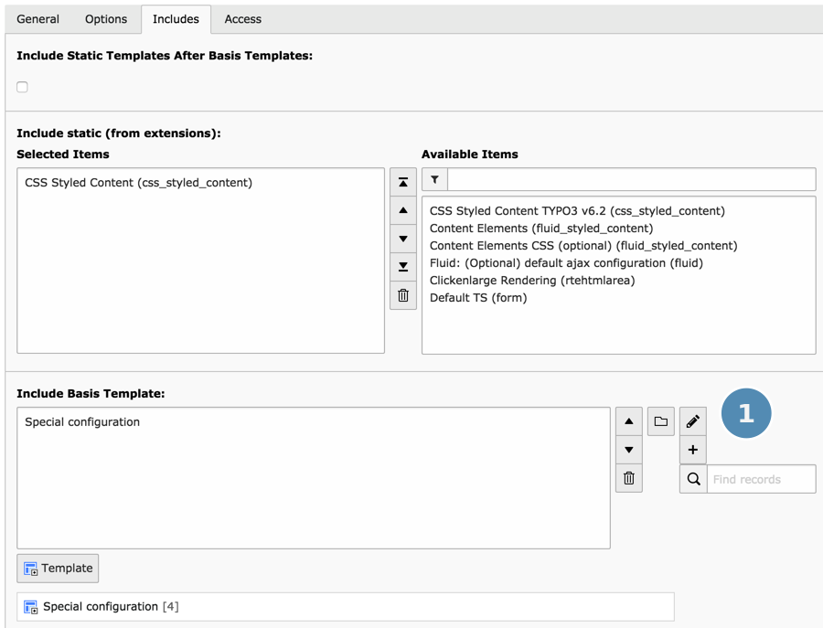

.. include:: ../Includes.txt

.. _typoscript-syntax-typoscript-templates-structure:

=============================
Add TypoScript in the backend
=============================

At its most basic, TypoScript is entered manually in both the
"Constants" and "Setup" fields of template records (which are
stored in the database in table "sys_template").

This can be done in the :guilabel:`Web > Template` module in
the TYPO3 backend.

.. hint::

   It is best practice to use a Sitepackage extension to bundle
   various configuration in an extension. See :ref:`t3sitepackage:start`.

.. figure:: ../Images/TemplatesRecordListView.png
   :alt: A TypoScript template as seen in the Web > List module.

.. figure:: ../Images/TemplatesInput.png
   :alt: The Constants and Setup fields of a TypoScript template

If the "t3editor" system extension is not installed or has been
disabled via configuration options, the "Constants" and "Setup" fields
will be normal multi-line text fields.

.. figure:: ../Images/TemplatesInputNoT3Editor.png
   :alt: The Constants and Setup fields without the t3editor enabled

.. _typoscript-syntax-typoscript-templates-structure-includes:

Include TypoScript files
========================

In both the "Constants" and "Setup" fields, the
:ref:`@import <t3coreapi:typoscript-syntax-includes>` syntax can be
used to include TypoScript contained inside files::

   # Import a single file
   @import 'EXT:myproject/Configuration/TypoScript/randomfile.typoscript'

   # Import multiple files of a single directory in file name order
   @import 'EXT:myproject/Configuration/TypoScript/*.typoscript'

   # The filename extension can be omitted and defaults to .typoscript
   @import 'EXT:myproject/Configuration/TypoScript/'

   # Import TypoScript files with legacy ".txt" extension
   @import 'EXT:myproject/Configuration/TypoScript/Setup/*.txt'

.. _static-includes:

Include TypoScript from extensions
==================================

It is also possible to "Include static" templates from extensions.

.. rst-class:: bignums-xxl

#. Edit the whole template record

   In the :guilabel:`Web > Template` module, select :guilabel:`Info / Modify`
   and click :guilabel:`Edit the whole template record`.

   .. image:: ../Images/TemplatesStaticIncludes1.png

#. Chose the tab :guilabel:`Includes`

   .. image:: ../Images/TemplatesStaticIncludes2.png

#. Click the templates to include in :guilabel:`Available Items`.

   .. image:: ../Images/TemplatesStaticIncludes3.png

.. tip::

   The section :ref:`add-typoscript-in-extension` explains how extension
   developers can make TypoScript available for inclusion in their
   extensions.

Include other TypoScript templates
==================================

Apart from this, it is also possible to include other TypoScript template
records (in the field called "Include Basis Template").

.. _typoscript-syntax-typoscript-templates-structure-analyzer:

Template Analyzer
=================

With all those inclusions, it may happen that you lose the overview of the
template structure. The "Template Analyzer" provides an overview of this
structure. It shows all the templates that apply to the currently selected page,
taking into account inclusions and inheritance along the page tree.

.. figure:: ../Images/TemplatesAnalyzer.png
   :alt: All templates applying to a page, as used by the Introduction Package

Templates are taken into consideration from top to bottom, which means
that properties defined in one template may be overridden in templates
considered at a later point by the TypoScript parser.

In the Template Analyzer, you can click on any listed template to view
the content of its "Setup" and "Constants" fields.

.. figure:: ../Images/TemplatesAnalyzerDetails.png
   :alt: Viewing the content of a given template in the Template Analyzer

The line numbers are compiled from the first template to be included,
which is why the numbers are so high.
